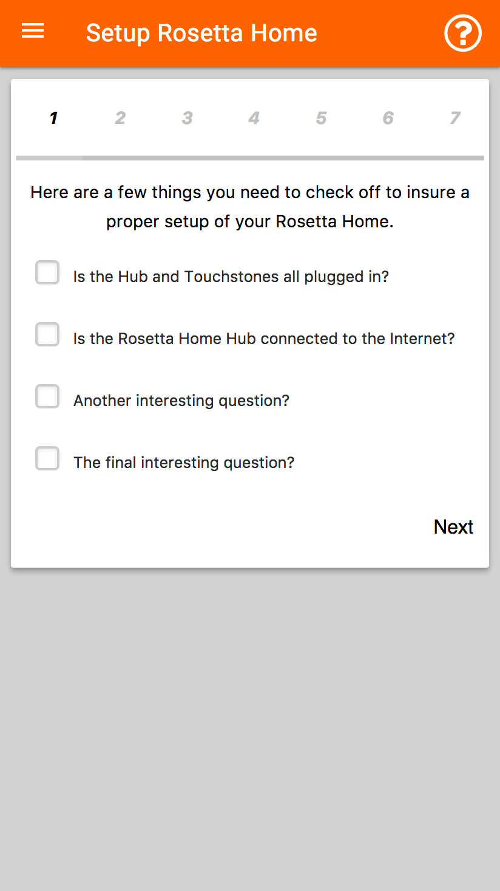
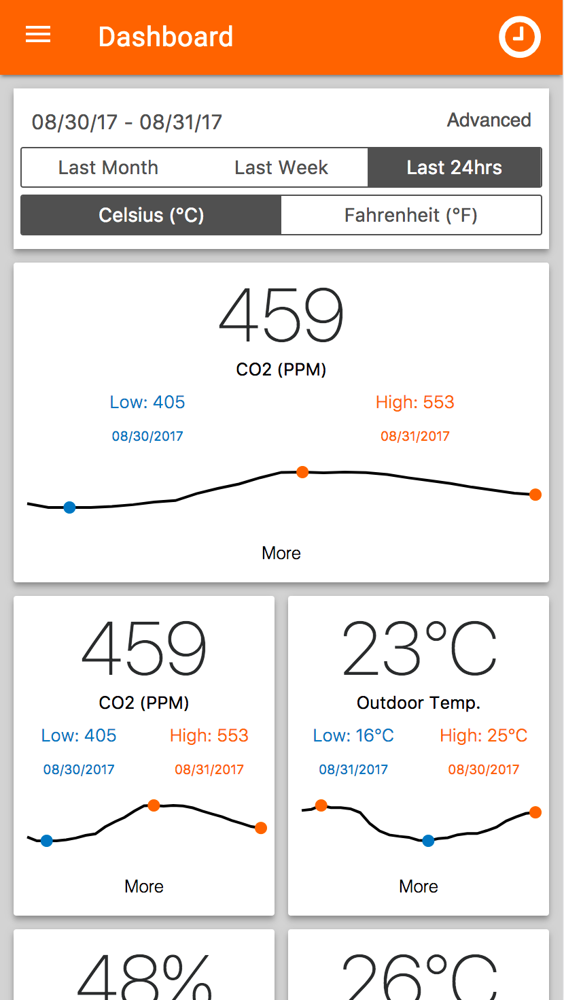
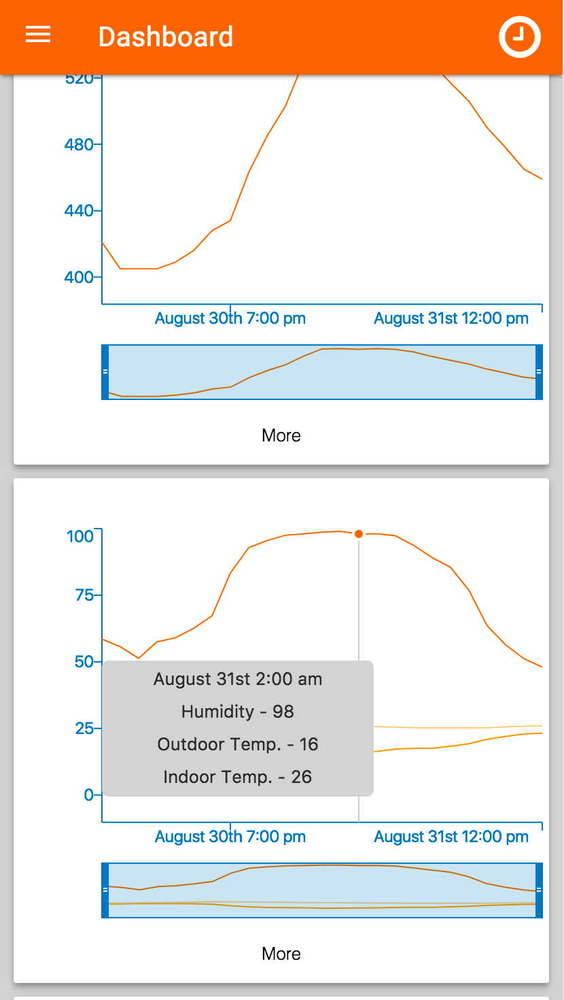
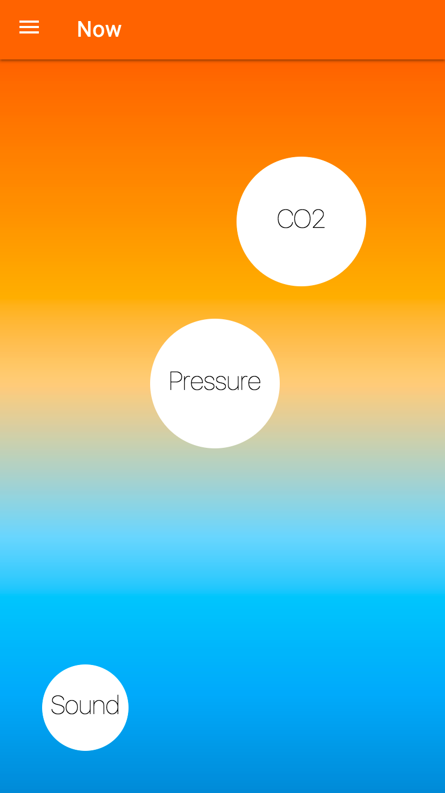

# Translator

Translator is the end-user client for Rosetta Home. Rosetta Home 2.0 is an open source building performance monitoring platform which is located <a href="https://github.com/rosetta-home">here</a>. Translator is a web application meant for interaction with your Rosetta Home sensors (Touchstones). The backbone of the project is a lightweight version of <a href="https://facebook.github.io/react/">React</a> called <a href="https://preactjs.com/">Preact</a>. Webpack and babel-core are used for compiling the web app. Authentication is done through Bearer and tokens which are valid up to one month at a time. The application makes use of redux store for managing the data set from the Satori API.

The backend for Rosetta Home located <a href="https://github.com/rosetta-home/brood">here</a>.

### Essential Libraries

  - <a href="https://github.com/developit/preact">preact</a>
  - <a href="https://github.com/developit/preact-mdl">preact-mdl</a>
  - <a href="https://github.com/developit/preact-redux">preact-redux</a>
  - <a href="https://github.com/developit/preact-router">preact-router</a>
  - <a href="https://github.com/developit/preact-compat">preact-compat</a>
  - <a href="https://momentjs.com/">moment</a>
  - <a href="https://github.com/visionmedia/superagent">superagent</a>

### Supporting Documentation

- <a href="https://facebook.github.io/react/docs/installation.html">React installation</a>
- <a href="https://preactjs.com/guide/switching-to-preact">Switching to Preact</a>
- <a href="https://webpack.github.io/docs/">Webpack Documentation</a>
- <a href="https://www.satori.com/channels/rosetta-home">Satori Rosetta Home Channel</a>

### Features

- [x] Authentication
  - [x] Login
  - [x] Signup
  - [x] Confirm Account
  - [x] Recover Password
  - Improvement Two-Step Verification (Security In-Mind!)
- [x] Google <a href="https://material.io/guidelines/">Material Theme</a>
- [x] Dashboard Charts
  - [x] Live Graph
  - [x] Bullet Chart
  - [x] Simple Data Point with Brush
  - [x] Multi Data Points with Brush
  - [x] Radial Compare
  - [x] Spark Graph
  - [x] Now Card
  - [x] Date Range Picker
- [x] Web App Life Cycle
  - [x] Detect UnAuth User
  - [x] Changes Current Route
  - [x] NavBar Title Change (Uses on-broadcast-emitter)
  - [x] SideMenu Options Change (Uses on-broadcast-emitter)
  - [x] Footer
  - [x] Login Page
  - [x] Dashboard Page
  - [x] Setup Page
  - [x] Signup Page

### Screenshots

  <p align="left">
  

  

  

  
  </p>

### Project Structure

  - src/
    - auth
    - components/
      - elements (Graphs)
      - layout (App layout components -> header,sidemenu,footer,navtitle)
      - pages (Login,Dashboard,etc.)
      - Setup
      - App.js (The skeleton of the app)
      - NotificationCenter.js (Notification component list)
    - service
    - style (CSS files)
    - actions.js
    - configs.js
    - index.js
    - reducers.js
    - store.js
    - util.js


# Skeleton

#### Translator's Backbone

```
<div className="App">
{/* Root of the Translator application, here is the basic layout of the web app with Google Material. */}
  <Layout fixed-header fixed-drawer>
    {/* Header component with title */}
    <Header/>
    {/* SideMenu with the options and router links */}
    <SideMenu/>
    {/* Provider for the redux storage */}
    <Layover/>
    <Provider store={store}>
    {/* Layout content area for the preact component */}
    <Layout.Content>
      <NotificationCenter/>
      {this.props.children}
    </Layout.Content>
    {/* Layout content area end tag */}
    </Provider>
    {/* Provider for the redux storage end tag */}
    </Layout>
  {/* Footer for the whole applicaiton */}
  <Footer/>
</div>
```
<b>Header</b> contains the NavTitle and RightItem component which when linked to the react broadcast will change the contents of the children when an event is emitted, i.e. the title of the current page in the body. <b>Layover</b> is in charge of handling all the modal pop ups. Once a layover is rendered with the component props ,if a valid VNode is passed it will be rendered within the layover. The callback payload is optional. <b>SideMenu</b> contains all the options for the current state. For example if the user is not logined into their Rosetta Home account, no token will be detected and the SideMenu will display options for a guest user, such as, Login, Setup, Help, Home, etc. Once a session is confirmed the react broadcast will emit a update to the SideMenu which will re-render the component with auth-user options (Dashboard,Settings,etc.) without re-rendering the whole App from the Root node down. <b>NotificationCenter</b> will display notifications from the user interaction from failed Login to issues with the touchstones themselves. The ```{this.props.children}``` is the pages in the current route state from the URL matching in the ```index.js```. Everything in the life cycle of the application will play in the ```Layout.Content```.

#### Web-Socket Promises

The websocket promise is located in ``` wsp.js ```. It has two parts: the first is the websocket and the promise manager. When an instance of the wsp is created, it requires a URI link to connect. Once it has been connected, JSON Objects can be sent in the way of payloads. As a request is created, a unique ID is added to the payload for the backend to return with processed request. The purpose of having a unique token is that as the request is processing promises are going into a pending state until an ```onmessage``` is trigged and resolves the pending promises with the response data.

# Documentation

### Graphs / Charts

| Parameters |  |
|---------|----------------|
| datapoint | This is the datapoint ID you want to have for the Graph/Chart render, for example, ```datapoint="ieq.co2"```     |
| startDateTime | The starting date and time to retrieve the data set. Needs to be formatted as <a href="https://www.timeanddate.com/time/aboututc.html">UTC</a>. |
| endtDateTime | The ending date and time to retrieve the data set. Needs to be formatted as <a href="https://www.timeanddate.com/time/aboututc.html">UTC</a>. |
| dres | The data resolutions for the data retrieved from the backend. |

<b>BulletChart</b> a simple Bulletchat that displays the min, mean, max, and current values of the datapoint.

```
const point = "ieq.co2";
const dres = '1d';
<BulletChart datapoint={point} startDateTime={fromValue} endDateTime={toValue} dres={dres}/>
```

<b>BarChart</b> is a simple bar chart which can take in only one datapoint at the current time.

```
const point = "ieq.co2";
const dres = '1d';
<BarChart datapoint={point} axisEnabled={false} startDateTime={fromValue} endDateTime={toValue}/>
```

<b>Now</b> is an overview of the current datapoint with min max avg and tend via sparkline.

```
const point = "weather_station.humidity";
const dres = '1d';
<NowCard datapoint={point} startDateTime={fromValue} endDateTime={toValue} dres={dres}/>
```

<b>HeatMap</b> allows the user to see a HeatMap of the datapoint that was selected, as well as in the given date range.

```
const point = "ieq.co2";
const dres = '1d';
<HeatMap datapoint={point} startDateTime={fromValue} endDateTime={toValue} dres={dres}/>
```

<b>MultiDPChart</b> is a simple line chart which has the option for a threshold and populates more than one data point, i.e. all the data points from the weather station.

```
/* Data points to graph */
const dres = '1d';
const points = "weather_station.humidity,weather_station.outdoor_temperature,weather_station.indoor_temperature";
<MultiDPChart datapoints={points} startDateTime={fromValue} endDateTime={toValue} dres={dres}/>
```
<b>SparkGraphLive</b> is a mix of the sparkline and the LiveGraph. The component has the most current value on the left side of the component and a sparkline to the right.

```
/* Id of the data point */
const datapoint = "weather_station.humidity";
const dres = '1d';
<SparkGraphLive type={datapoint} startDateTime={fromValue} endDateTime={toValue} dres={dres}/>
```

<b>LiveGraph</b> is a live graph component that interfaces with Satori and redux provider.

```
/* Rosetta Home NodeID on Satori */
const nodeID = "0000000081474d35";
/* Data points to stream */
const points = "weather_station.outdoor_temperature";
<RHLiveGraph nodeID={nodeID} type={points} startDateTime={fromValue} endDateTime={toValue}/>
```
